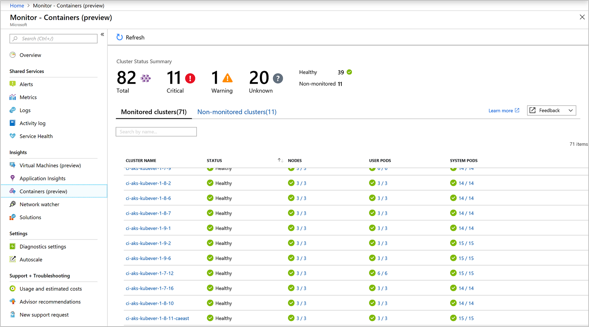
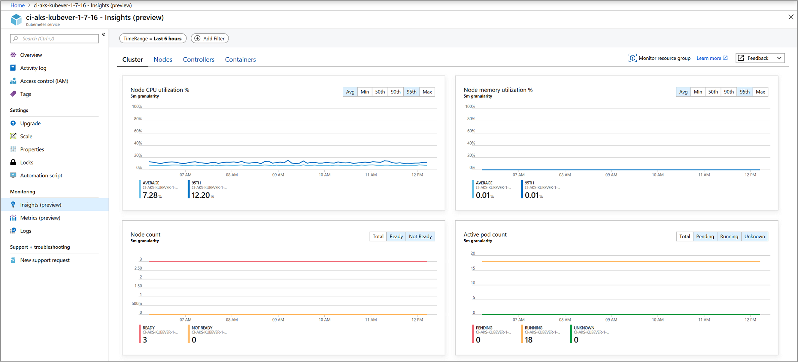
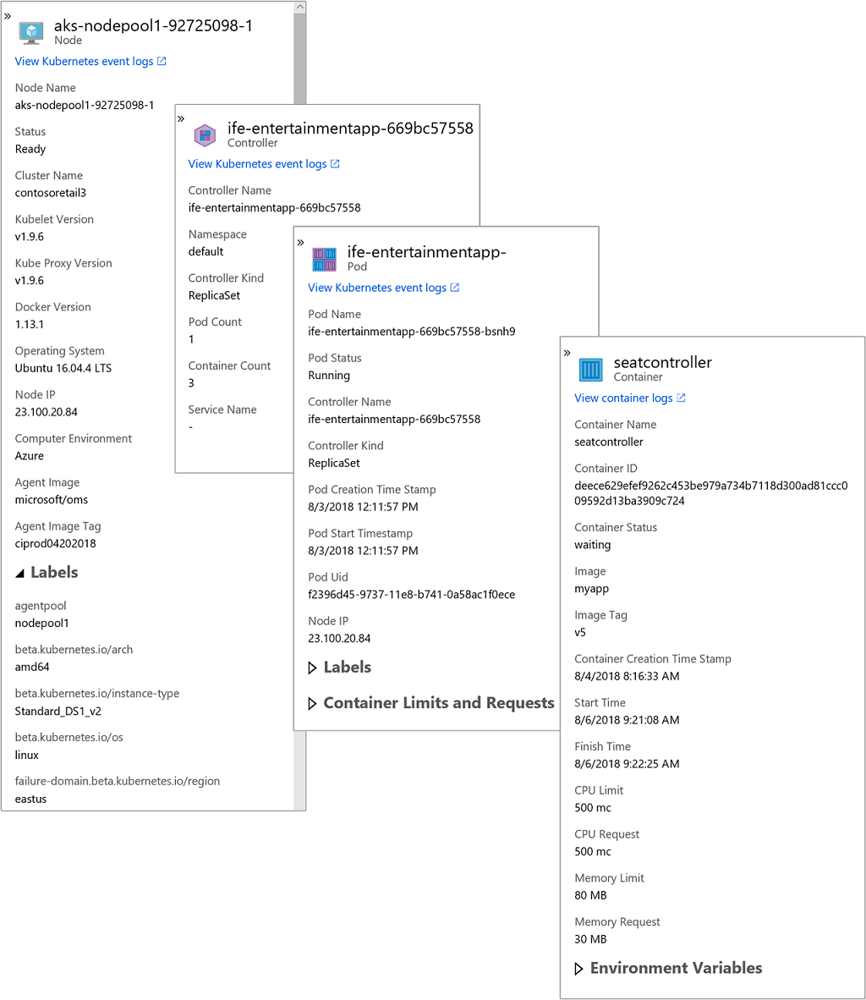
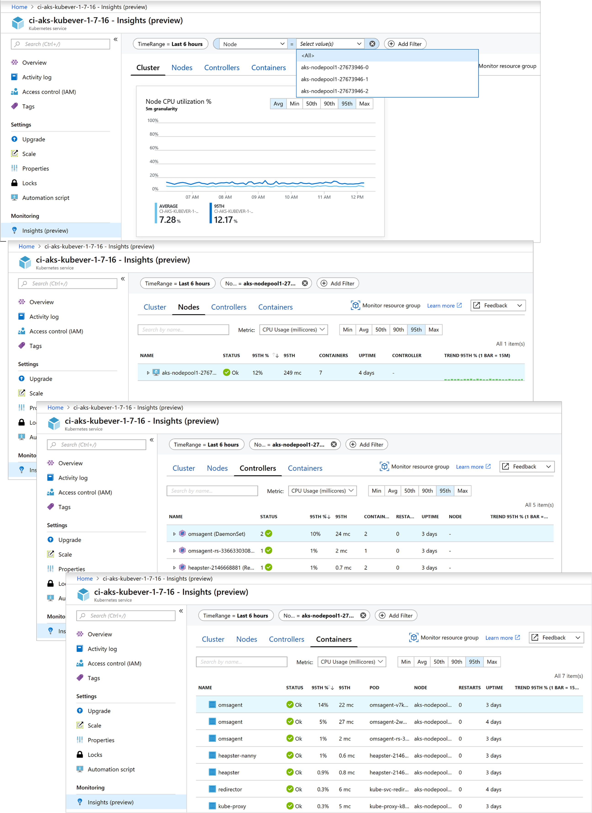
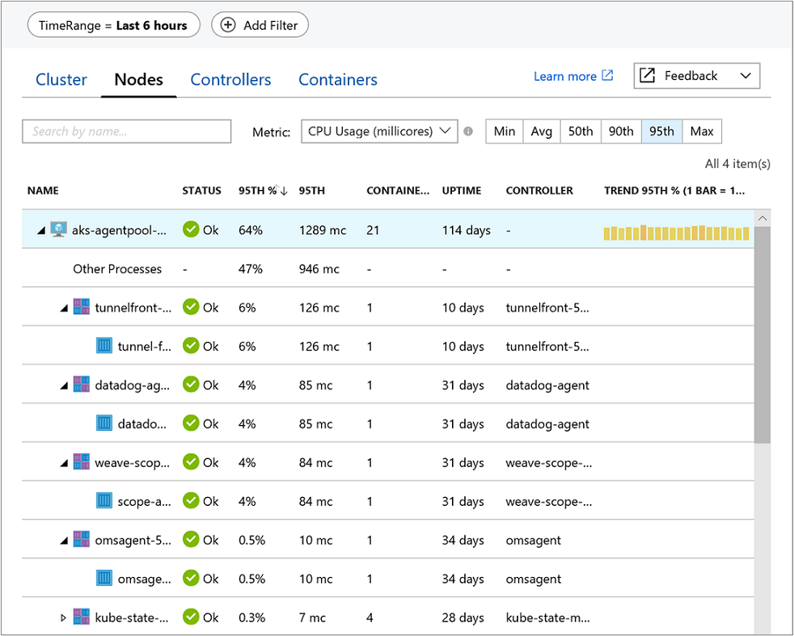
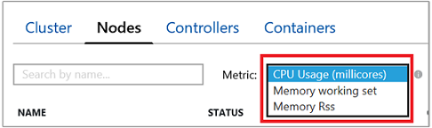
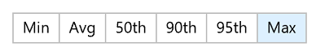
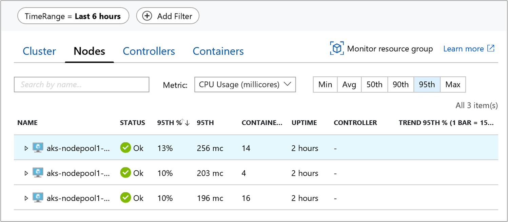
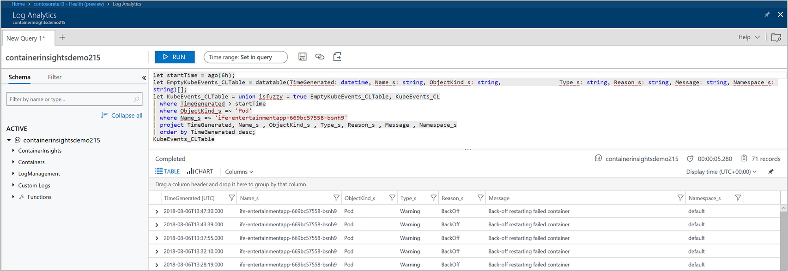

# Lab: Working with Azure Log Analytics

This lab walks through the process of setting up Azure Monitor for containers to monitor the performance of workloads that are deployed to Kubernetes environments and hosted on Azure Kubernetes Service.

## Prerequisites

* Complete previous labs for setting up [AKS](../../create-aks-cluster/README.md).

## Instructions

> **Note:** Because we used the `--enable-addons monitoring` flag when we created our cluster, this step is already complete, and no this step is informational only.

1. Enable monitoring

   * **Option 1:** Use the **Azure CLI**  

      ```bash
      az aks enable-addons -a monitoring -n $CLUSTERNAME -g $RGNAME
      ```

   * **Option 2:** Use the **Azure Portal**  

      a. In the Azure portal, select **Monitor**.  
      b. Select **Containers** from the list.  
      c. On the left sidebar, under **Insights**, select **Containers (preview)** option, and then select **Non-monitored clusters** tab on the right-hand section of the page.  
      d. From the list of non-monitored clusters, find the container in the list and click **Enable**.  
      e. On the **Onboarding to Container Health and Logs** page, if you have an existing Log Analytics workspace in the same subscription as the cluster, select it from the drop-down list. The list preselects the default workspace and location that the AKS container is deployed to in the subscription.  
         
      
        
      > **Note:** If you want to create a new Log Analytics workspace for storing the monitoring data from the cluster, follow the instructions in [Create a Log Analytics workspace](https://docs.microsoft.com/en-us/azure/log-analytics/log-analytics-quick-create-workspace). Be sure to create the workspace in the same subscription that the AKS container is deployed.  
  
2. Verify agent and solution deployment  

   With agent version 06072018 or later, you can verify that both the agent and the solution were deployed successfully. With earlier versions of the agent, you can verify only agent deployment.

   Run the following command to verify that the agent is deployed successfully.  

   ```bash
   kubectl get ds omsagent --namespace=kube-system
   ```

   The output should resemble the following, which indicates that it was deployed properly:  

   ```bash
   NAME       DESIRED   CURRENT   READY     UP-TO-DATE   AVAILABLE   NODE SELECTOR                 AGE
   omsagent   2         2         2         2            2           beta.kubernetes.io/os=linux   1d
   ```

   To verify deployment of the solution, run the following command:

   ```bash
   kubectl get deployment omsagent-rs -n=kube-system
   ```

   The output should resemble the following, which indicates that it was deployed properly:

   ```bash
   NAME       DESIRED   CURRENT   UP-TO-DATE   AVAILABLE    AGE
   omsagent   1         1         1            1            3h
   ```

   You can also confirm propery setup using the Azure CLI:

   ```bash
   az aks show -n $CLUSTERNAME -g $RGNAME
   ```

   Once the command completes and returns JSON-formatted information about solution, the results of the command should show the monitoring add-on profile and resembles the following example output:

   ```json
   "addonProfiles": {
     "omsagent": {
       "config": {
         "logAnalyticsWorkspaceResourceID": "/subscriptions/<WorkspaceSubscription>/resourceGroups/<DefaultWorkspaceRG>/providers/Microsoft.OperationalInsights/workspaces/<defaultWorkspaceName>"
        },
        "enabled": true
      }
   }
   ```  

3. Verify you are seeing logs in Log Analytics by starting a container and sending logs to STDOUT.

   Run the following command to start an nginx container and exec into the container. .

   ```bash
   kubectl run nginx-test --rm -ti --image=nginx /bin/sh
   ```

   When you are exec'd into the contatiner run the following command to generate logs and send to STDOUT. 

   ```bash
   echo "hackfest test logs " >> /proc/1/fd/1
   ```

   Give this a few minutes for logs to appears in Log Analytics. Do thefollowing to see the logs. 

   
   Open the Azure Portal | Select the Kubernetes service object | Select the Insights (preview) | Select Nodes | drill down through each of the nodes and find the nginx pod | after you select the pod choose the    Logs link and this will open Log Analytics. Look through the logs until you see the output from above. 


4. Analyze cluster data from the **Monitor** section of the portal

   To view the health status of all AKS clusters deployed, select **Monitor** from the left-hand pane in the Azure portal. Under the Insights section select **Containers (preview)**.  

     

   On the **Monitored clusters** tab, you are able to learn the following:  

      1. How many clusters are in a critical or unhealthy state, versus how many are healthy or not reporting (referred to as an unknown state)?  
      2. How many nodes, user and system pods are deployed per cluster.  

   The health states defined are: 

      1. **Healthy** – no issues detected for the VM and it is functioning as required.  
      2. **Critical** – one or more critical issues are detected, which need to be addressed in order to restore normal operational state as expected.  
      3. **Warning** - one or more issues are detected, which need to be addressed or the health condition could become critical.
      4. **Unknown** – if the service was not able to make a connection with the node or pod, the status changes to an unknown state.

   Health state calculates overall cluster status as "*the worst of*" the three states with one exception – if any of the three states is *unknown*, overall cluster state will show **Unknown.**  

   From the list of clusters, you can drill-down to the **Cluster** page by clicking on the name of the cluster, to the **Nodes** performance page by clicking on the rollup of nodes in the **Nodes** column for that specific cluster, or drill-down to the **Controllers** performance page by clicking on the rollup of **User pods** or **System pods** column.  

5. Analyze cluster data on the **Cluster**

   Access to Azure Monitor for containers is available directly from an AKS cluster by selecting **Insights (preview)** from the left-hand pane. Viewing information about your AKS cluster is organized into four perspectives:

      * Cluster
      * Nodes
      * Controllers
      * Containers

   The default page opened when you click on **Insights (preview)** is **Cluster**, and it includes four line performance charts displaying key performance metrics of your cluster.  

   

   The performance chart displays four performance metrics:  

      * **Node CPU Utilization %**: An aggregated perspective of CPU utilization for the entire cluster. You can filter the results for the time range by selecting **Avg**, **Min**, **Max**, **50th**, **90th**, and **95th** in the percentiles selector above the chart, either individually or combined.  

      * **Node memory utilization %**: An aggregated perspective of memory utilization for the entire cluster. You can filter the results for the time range by selecting **Avg**, **Min**, **Max**, **50th**, **90th**, and **95th** in the percentiles selector above the chart, either individually or combined.  
    
      * **Node count**: A node count and status from Kubernetes. Statuses of the cluster nodes represented are *All*, *Ready*, and *Not Ready* and can be filtered individually or combined in the selector above the chart.  

      * **Activity pod count**: A pod count and status from Kubernetes. Statuses of the pods represented are *All*, *Pending*, *Running*, and *Unknown* and can be filtered individually or combined in the selector above the chart.  

   When you switch to **Nodes**, **Controllers**, and **Containers** tab, automatically displayed on the right-side of the page is the property pane. It shows the properties of the item selected, including labels you define to organize Kubernetes objects. Click on the >> link in the pane to view\hide the pane.  

   

   As you expand the objects in the hierarchy, the properties pane updates based on the object selected. From the pane you can also view Kubernetes events with pre-defined log searches by clicking on the **View Kubernetes event logs** link at the top of the pane.  

   Use the **+ Add Filter** option from the top of the page to filter the results for the view by **Service**, **Node**, or **Namespace** and after selecting the filter scope, you can then select the from one of the values shown in the **Select value(s)** field. After the filter is configured it is applied globally while viewing any perspective of the AKS cluster. The formula only supports the equal sign. You can add additional filters on top of the first one to further narrow your results. For example, if you specified a filter by **Node**, your second filter would only allow you to select Service or Namespace.  

   

   Specifying a filter in one tab continues to be applied when you select another and it is deleted after you click the **x** symbol next to the specified filter.  

   Switch to the **Nodes** tab and the row hierarchy follows the Kubernetes object model, starting with a node in your cluster. Expand the node and you can view one or more pods running on the node. If more than one container is grouped to a pod, they are displayed as the last row in the hierarchy. You can also view how many non-pod related workloads are running on the host if the host has processor or memory pressure.  

   

   You can select controllers or containers at the top of the page and review the status and resource utilization for those objects. If instead you want to review memory utilization, in the **Metric** drop-down list, select **Memory RSS** or **Memory working set**. **Memory RSS** is supported only for Kubernetes version 1.8 and later. Otherwise, you view values for **Min %** as *NaN %*, which is a numeric data type value that represents an undefined or unrepresentable value.  

   

   By default, Performance data is based on the last six hours, but you can change the window by using the **TimeRange** option at the upper left. You can also filter the results within the time range by selecting **Avg**, **Min**, **Max**, **50th**, **90th**, and **95th** in the percentile selector.  

   

   In the following example, note for node aks-nodepool1-, the value for **Containers** is 14, which is a roll-up of the total number of containers deployed.

   

   It can help you quickly identify whether you have a proper balance of containers between nodes in your cluster.  

   You can continue to explore the available performance metrics for **Controllers** and **Containers**.

6. Search logs to analyze data

   Log Analytics can help you look for trends, diagnose bottlenecks, forecast, or correlate data that can help you determine whether the current cluster configuration is performing optimally. Pre-defined log searches are provided for you to immediately start using or to customize to return the information the way you want.  

   You can perform interactive analysis of data in the workspace by selecting the **View Kubernetes event logs** or **View container logs** option in the preview pane. The **Log Search** page appears to the right of the Azure portal page that you were on.

   

   The container logs output that's forwarded to Log Analytics are STDOUT and STDERR. Because Azure Monitor is monitoring Azure-managed Kubernetes (AKS), Kube-system is not collected today because of the large volume of generated data.  

   It's often useful to build queries that start with an example or two and then modify them to fit your requirements. To help build more advanced queries, you can experiment with the following sample queries:

   ```
   # List all of a container's lifecycle information
   ContainerInventory
   | project Computer, Name, Image, ImageTag, ContainerState, CreatedTime, StartedTime, FinishedTime
   | render table

   # Kubernetes events
   KubeEvents_CL
   | where not(isempty(Namespace_s))
   | sort by TimeGenerated desc
   | render table

   # Image inventory
   ContainerImageInventory
   | summarize AggregatedValue = count() by Image, ImageTag, Running

   # Container CPU (**In Advanced Analytics, selct line charts**)
   Perf
   | where ObjectName == "Container" and CounterName == "% Processor Time"
   | summarize AvgCPUPercent = avg(CounterValue) by bin(TimeGenerated, 30m), InstanceName

   # Container Memory (**In Advanced Analytics, selct line charts**)
   Perf 
   | where ObjectName == "Container" and CounterName == "Memory Usage MB"
   | summarize AvgUsedMemory = avg(CounterValue) by bin(TimeGenerated, 30m), InstanceName
   ```

## Troubleshooting / Debugging

* [Monitor enabled, but not reporting any information](https://docs.microsoft.com/en-us/azure/monitoring/monitoring-container-insights-troubleshoot)

## Docs / References

* [How to onboard Azure Monitor for containers](https://docs.microsoft.com/en-us/azure/monitoring/monitoring-container-insights-onboard)
* [Using Azure Montior for containers](https://docs.microsoft.com/en-us/azure/monitoring/monitoring-container-insights-analyze)

#### Next Lab: [Service Mesh w/ Distributed Tracing](../../servicemesh-tracing/README.md)
